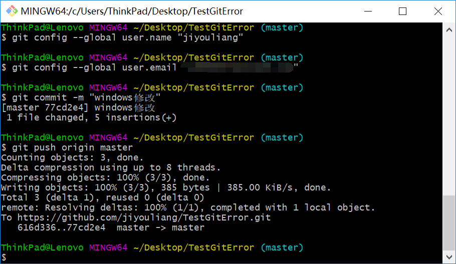

# 测试Github账号认证问题

> 说明：发现git来回切换用户后，提交到github失败，不论.git目录是否重新生成。

### 1.在Linux Ubuntu运行结果

系统：ubuntu 16.04
成功提交到github

### 2. window运行结果

切换到win 10系统

运行结果如下图

### 3.结论

**一天电脑尽量一个用户**

之前在一台电脑来回切换各种用户，演示多用户操作，可能是导致失败的问题。

